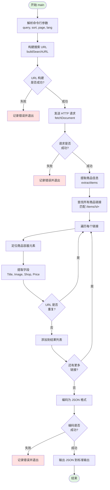

# Main 函数流程图

这是 `main.go` 程序的执行流程图，展示了 Booth.pm 商品搜索爬虫的主要处理步骤。

## 主要流程说明

1. **参数解析** - 使用 `flag` 包解析命令行参数（查询关键字、排序方式、页码、语言）
2. **URL 构建** - 调用 `buildSearchURL()` 生成 Booth.pm 搜索 URL
3. **HTTP 请求** - 调用 `fetchDocument()` 获取搜索结果页面
4. **数据提取** - 调用 `extractItems()` 解析 HTML 并提取商品信息
5. **去重处理** - 使用 map 确保每个 URL 只出现一次
6. **JSON 输出** - 将结果编码为 JSON 格式并输出到标准输出

## 关键函数

- `buildSearchURL()` - 构建搜索 URL，支持语言、排序和分页
- `fetchDocument()` - 发送 HTTP GET 请求，返回 goquery 文档对象
- `extractItems()` - 从 HTML 中提取商品标题、链接、图片、店铺名和价格
- `absolute()` - 将相对 URL 转换为绝对 URL
